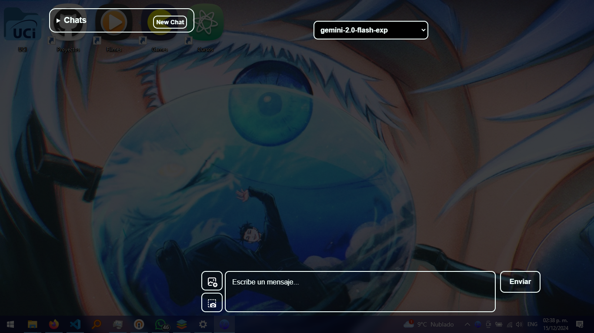
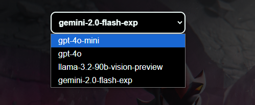
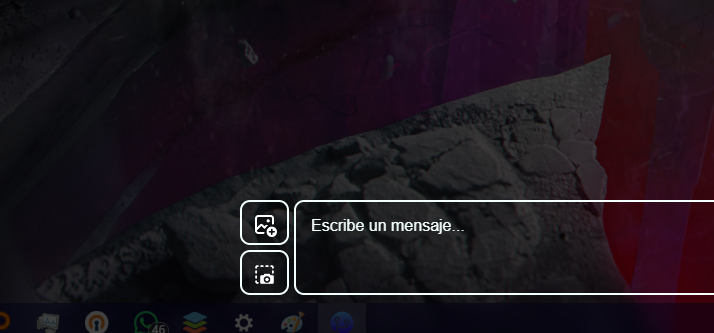

# An Electron desktop application chatbot
A NodeJS with electron application using the API of OpenAI, Google Gemini, and Meta Llama 3.2 from the Groq Plattform.

## Easy way to chat with the AI
The chatbot will show or hide the interface when the user call to the hotkey Alt + Spacebar (Yes, we copied it from the ChatGPT Application for desktop 😅).

The application shows up in a transparent window to let the users keep watching at what is behind the assistant, what is excelent for coding.

## Multiple AI Models
This application also let you to choose the AI model that you want to use, for example:
1. GPT 4o
2. GPT 4o Mini
2. Llama 3.2
3. Gemini 2.0

## Multimodal image processing
This application is made to process images as well as text, using the multimodal capabilities of these models.

(It let you to pick an image or take a screenshot of what you're watching)